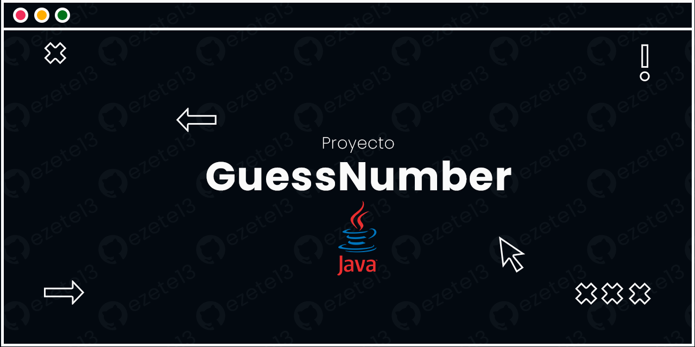
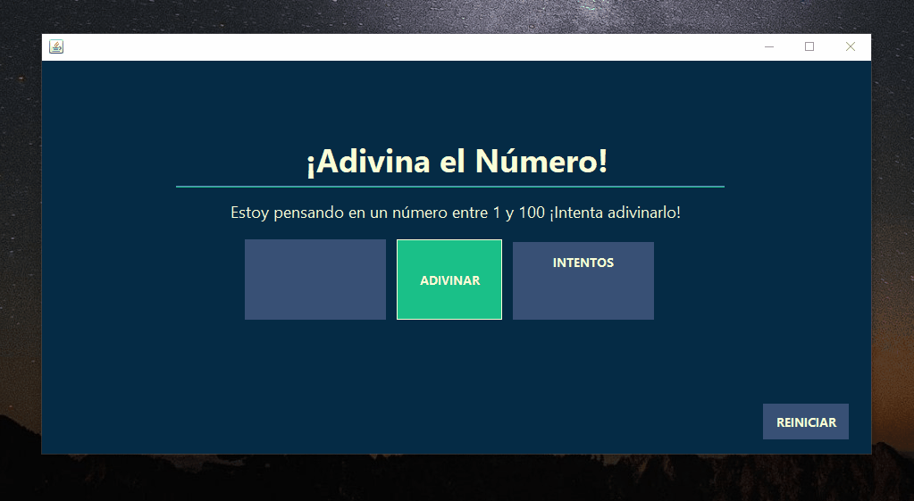

# GuessNumber

Este proyecto es una aplicación de escritorio en el cual se debe adivinar un numero aleatorio del 1 al 100. 

# DEMO

# ¿Cómo funciona?

- Dirigirse al directorio /dist descargar AdivinarNumero.exe y luego ejecutarlo.
- Introducir numeros, la interfaz indicará que tan alto o bajo es el numero en comparación con el correcto.

# Tecnologías Utilizadas

-Java
-JSwing

# Instalación y Ejecución

1. Clona este repositorio (git clone https://github.com/ezete13/GuessNumber.git).
2. Abrir el codigo fuente en el IDE. 

# Contribuir
¡Siéntete libre de contribuir a este proyecto! Puedes enviar pull requests con nuevas características, mejoras o correcciones de errores.

# Créditos
Este proyecto fue desarrollado como parte de un proyecto universitario por Ezequiel Tello.

# Licencia
Este proyecto está bajo la licencia [Licencia](LICENSE.md) - consulta el archivo [LICENSE.md] para más detalles.
